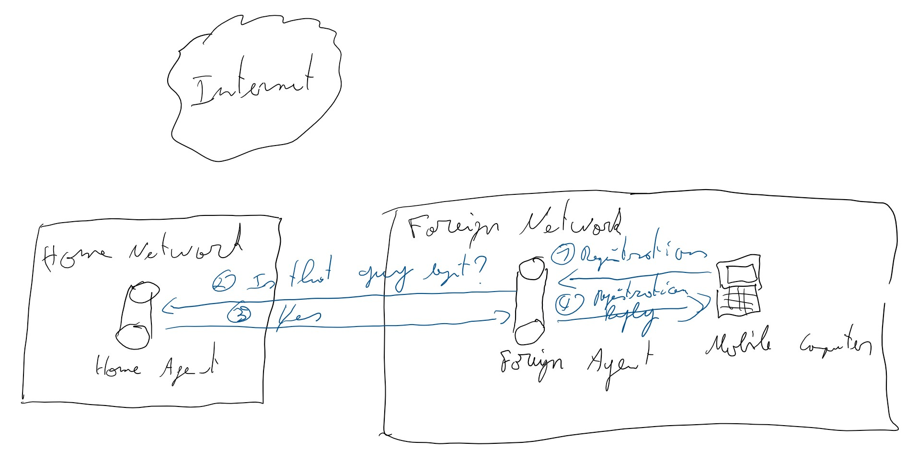
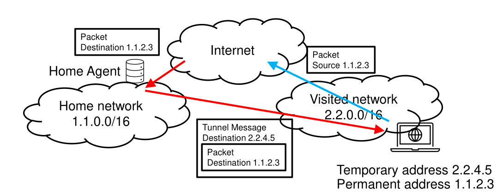

# Mobile and Embedded Computing : Exam questions

## Introduction

These questions come from an old exam that has been retrieved from somewhere. If you think of additional questions that might be interesting and relevant to help people to study, feel free to add them even if they don't come from an exam.

Questions have been splited in two categories :

- **Embedded questions** : Questions relative to the first part of the course, concerning subjects such as CoAP, MQTT or RPL.
- **Mobile questions** : Questions relative to the second part of the course, which is the whole GSM part.

Have fun !

## Embedded questions

### Scheduling

>1. Explain *Priority Inversion*. Draw a picture of an example (i.e. a timeline with several tasks) and show on that picture where and why the priority inversion happens.
>2. Explain the *Immediate Priority Ceiling protocol* and show why and how it solves the problem of priority inversion in your example at the previous point.

1. In a system where tasks can be dependent, a process can be kept waiting because another one is accessing a critical section (typically using mutexes). In such a situation, a high priority process can be kept waiting because a low priority one is in critical section. But this low priority process can itself be interrupted many times by medium priority processes as they preempt over low priority processes, without knowing that there is actually a high priority processing waiting. This can lead to important delays for high priority tasks, which can be dramatic (Airbag opening too late, self-driving car changing direction too late, etc).

2. A solution to this problem is the *Immediate Priority Ceiling Protocol*, which states that if $S = \{t_1,t_2,..., t_k\}$ is the set containing every thread that can possibly use a given critical section, then any of this thread receives $\underset{t_i \in S}{max}(prio(t_i))$ as priority value when entering in critical section and until it leaves it. This avoids the priority inversion as a process inherits of the priority of the most important process using the critical section.

### CSMA

>1. How can a CSMA/CA give higher priorities to certain frame types ?
>2. What problem of CSMA/CA does CSMA/CA with RTS/CTS solve ? *Explain the problem*.
>3. Can collisions happen in CSMA/CA with RTS/CTS ? Explain.

1. CSMA/CD uses an *Inter-Frame Spacing* time which is the time a node should wait **on an idle channel** before sending. Some priority can be defined by reducing this IFS for some node and not for others, meaning that an important node would have to wait less time than a non-important one.

2. It solves the *Hidden Station Problem*. In a wireless network, it is possible for two node to communicate with a station without seeing each other. In such a situation, any attempt at detecting collision from a sender is useless. To solve this, CSMA/CA can use  *Request To Send* and *Clear To Send* messages. Typically, a node would send a *RTS* to the base station to request the right to send. The base station would then allow it to send data by responding with a *CTS*. This will allow the base station to put some order in the network and control who's sending packets.

3. Yes, collision is still possible on control frames, but it not as bad as collision on data frames as control frames are usually much smaller that data ones.

### CoAP

>1. What are tokens used for in CoAP ?
>2. Describe a possible attack against CoAP's token mechanism. How can you defend against such an attack ?
>3. Give two major differences between CoAP and HTTP/1 that make CoAP suitable for constrained environments such as networks with IEEE 802.15.4 . Explain briefly.

1. Tokens are 8 bytes long value generated by the client and put into the CoAP packet. This token is then reused by the server when responding to the request. This allows the client to understand which message the server is responding to.
2. A possible attack using the token mechanism is the response spoofing attack, where an attacker might choose a random token value and sends fake response to client. A way to mitigate this problem is to use sufficiently randomized token values to make spoofing ineffective.
3. Two major differencies
    - HTTP/1 works over TCP (or something else, but it assumes a **reliable transport**), while CoAP works over UDP, avoiding the signaling overhead of TCP (3-way handshake, acks, Fast recovery, etc)
    - CoAP headers are transmitted in binary format, very compact and allows to avoid IP fragmentation.

### RPL

>- Draw a small wireless network (3 or 4 nodes) and explain how the RPL control messages are used to build the initial RPL DODAG (For sake of simplicity, ignore version numbers and trickle timers).
>- What are Tickle timers used for in RPL ? (You don't have to explain how it works).
How would you implement a HELLO Flooding attack against a RPL network ? What is a possible defense ?

1. Nodes requesting to join the network will send a *DODAG Information Solicitation* which will be answered by a node in the network with a *DODAG Information Object* message. Once a node has joined the network, his parent sends a *DODAG Information Object* message towards root in order to allow parents node to populate their routing tables. In case a node receives multiple *DIO*, it can choose the best parent according to whatever criteria is important (Strong signal, lower rank, etc). Rank is supposed to represent the depth of the *DODAG*, the more important it is, the further away from the root.

2. &nbsp;
   - **Trickle timers** are timers that defines when a node should send a DIO message (which is sent periodically). This timer is built such in a way that a node will transmit a lot in case of a problem in the network (A node going down requiring to adjust paths, etc) but will say almost idle if nothing happens.
   - A **HELLO Flooding** attack can be performed using DIO messages sent by a rogue node with a strong signal power and good routing metrics. It will make nodes believe they have a good neighbor and they will try to select it.
   - **Solution** : A good old encryption.

### Mobility

>1. Assume a computer with a mobile address that is brought into a foreign network. Explain the steps done by Mobile IP, so that the computer gets connectivity.
>2. What is Triangular Routing ? Explain it and describe why we cannot always use it.
>3. In CDMA, an important parameter is the length of the code. What is the advantage of using a long code ? What is the disadvantage ?

1. 
2. 
    - The problem with this configuration is that some middleboxes *between* the visited network and the internet won't like seeing packets with IPs that doesn't seem to belong to their network. Other middlebox won't tolerate to exchange TCP packets without seeing 3-way handshake first (In this configuration, a middlebox might see a SYN and an ACK, but might not see the SYN-ACK as it is transmitted through the Home Network). A solution to this problem is make all the traffic go through the Home Agent, similarly to a VPN.
3. CDMA allows multiple User Equipment to send at the same time. To do so, each UE receives a code that defines how it should encode a symbol (ex : if a UE wants to send *1* with a code *010011*, it will have to send *-1 +1 -1 -1 +1 +1* over the network). This encoding will allow the receiver to extract each message from the big mess that will be formed by the mix of all the messages sent by different UE at the same time. Obviously, the longer the code is, the slower the data rate is. Antennas tends to give long codes to idle UE. When an UE starts transmitting, it will transmit slowly until it receives a shorter code.

## Mobile questions

### In-band signaling vs Out-of-band signaling

>Does TCP/IP uses in-band or out-of-band signaling for its control information ?

In-band, as it uses the same channel as the data to transfer signalling information (TCP headers, TCP ack, IP update messages, etc).

### GSM FDMA

>GSM-900 uses FDMA with 124 downlink and 124 uplink frequencies. In practice, why a BTS cannot use all frequencies ?

Because there is always interferences between BTS. To avoid conflicts, neighboring BTS don't use the same frequencies. This implies that a given BTS only uses a fraction of the available frequencies, leaving unused channels to its neighbors.

### GSM logical channels

>Why does GSM use logical channels that are mapped to physical channels ? Could we not just use physical channels directly ? For example we could define Physical channel 1 = FCCH, Physical Channel 2 = AGCH, etc.

$\text{number of frequencies} \times \text{time division per frequency}$ gives the total number of Mobile Stations can communicate with the Base Station at the same time. Using physical channels (i.e. A certain timeslot in a certain frequency) instead of physical channels would **drastically reduce** the number of Mobile Stations a BS can handle simultaneously (as there is a shitload of different logical channel types).

### GSM call setup

>1. To save resources, the base station does not allocate a dedicated channel for every phone in a cell, since most are idle most of the time. But if a phone does not have a dedicated channel, how can it send a message to the base station to start a Phone call ?
>2. Can you imagine a concrete situation where the mechanism used by GSM in the previous question fails ?
>3. Imagine you are in LLN and you want to call your friend in Sydney (you and your friend have mobile phones). How is the connection established? In particular, how does the network find the destination? (we have not seen all the details in the course, but you should have a rough idea how it’s done)

1. When starting a phone call, a Mobile Station must reach the Base Station through the Random Access Channel (RACH) which is a channel available to every MS.
   - In case of collision, the MS waits a random amount of time (like ALOHA)
   - One the message is sent, the MS waits on another channel, the *Access Granting Channel* (AGCH), for a response.
2. This connection method can lead to problems when there are too many people trying start a phone call at the same time. This can result in collisions that the random backoff won't efficiently mitigate.
3. This implies many steps :
   
   0. BTS sends information concerning how MS should contact it in slot 0 of one of the 124 possible frequencies, called the *Fast Forwarding Control Channel*. MS have to look at each in order to find the information it needs (such as the RACH/AGCH channels for example)
   2. MS reaches the BS on the RACH (as explained above)
   3. MS waits on the AGCH for the BS response allocating a *Standalone Dedicated Control Chanel* (SDCCH) to the MS.
   4. MS sends a call request to the BS on the newly attribured *SDCCH*
   5. The Base Station Controller forwards the message to the network subsystem
   6. The network subsystem sets up the call if possible and sends and assignment request for a voice channel to the BSC
      1. To make the call, the Mobile Switching Center, which is connected to the Base Station Subsystem, queries information about the MS initiating the call (Billing infos, current position, etc) in the HLR. It can then refuse to make the call (if MS is out of credit for example) 
      2. The information is then passed to the MSC-Gateway to be handed to the PSTN
      3. The information about the incomming arrives to the MSC-G of the operator where the distination is located
      4. MSC-G query HLR to see in which VLR the destination is located, then forwards the information to the concerned MSC
      5. MSC check destination MS status (Is it turned of ? Is it still responding ? etc), if its okay all the BSS operated by the MSC sends the call notification to the MS.
      6. **Now you anwer that call you little rat ! Do you understand how hard it was to make your god damn phone ringing ?**
   7. The BSC allocates available dedicated traffic channel (TCH) to the MS and transfert these information (frequency + timeslot) through the SDCCH.
   8. The MS sends a message on the Fast Associated Control Channel (FACCH, logical channel on the same physical channel than TCH) telling the BSC that he's not listening to the SDCCH anymore
   9. The BSC acknowledges it with a message on the FACCH.
   10. MS sends an "assignment complete" message to the BSC on FACCH.
   11. BSC informs the network subsystem that the voice channel has been successfully established.
   12. Finally, MS can use the TCH to send voice data.

### Logical channel mapping

>There is an important question that has not been addressed on the slides: How does a MS know the mapping of the logical channels to the physical channels? For dedicated channels like SDCCH and TCH, the answer is on the slides (where?). But how does a MS that enters a cell know what frequencies are used by the BTS of the cell and which timeslots are used for the broadcast and common channels? Try to find some possible solutions. (Be creative. Don’t worry if you don’t find the solution actually used by GSM.)

Conventionally, operators transmit a particular signal on one of the channel at timeslot 0 (reminder : GSM-900 consists of 124 frequency bands, each divided in 8 timeslots). When a new phone arrives to the network, it can simply listen in all 124 possible slots 0 to find the one with a particular signal. This is the *Fast Forwarding Channel* (FFCH). This channel also transmits basic information such that broadcasts channels, etc.

### From circuits to packets

>The first GSM networks were only used for voice calls, but later GSM was extended to also allow Internet traffic. How would you transport Internet traffic over GSM (without modifying too much the existing infrastructure)? What problems could appear?

This can be performed rather simply by implementing a new type of logical channel : *Packet Data Traffic Channel* (PDTCH) and a *Packet Associated Control Channel* (PACH) for acknowledgments. 

Additionally, we'll need to bundle some timeslots in order to mitigate the limited bandwidth offered by GSM small frequencies.

A MS can request a PDTCH the same way that for a classical TCH (Via RACH and AGCH).